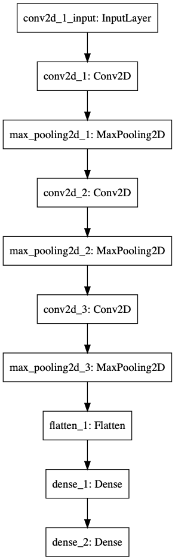

# Convolutional Neural Network - MNIST Fashion dataset
## Requirements
Quite a lot of libraries are required
Google them to install them depending on your OS
* keras / tensorflow
* numpy
* PIL
* cv2
* ...

## RUN
```bash
git clone https://github.com/MarvinMartin24/CNN_FashionMNIST.git
```
Go to your file directory, and run this command :
```bash
python3 main.py
```
By default it just apply the model, if you want to train it again
uncomment the function ```build_model()```

## Data

* Load from [MNIST Fashion](http://yann.lecun.com/exdb/mnist/)
* Data volume : 70 000 (Train 60 000 + Test 10 000)
* Input shape is 28x28x1 (Gray Scale Image)

### Labels
Each training and test example is assigned to one of the following labels:

| Label | Description |
| --- | --- |
| 0 | T-shirt/top |
| 1 | Trouser |
| 2 | Pullover |
| 3 | Dress |
| 4 | Coat |
| 5 | Sandal |
| 6 | Shirt |
| 7 | Sneaker |
| 8 | Bag |
| 9 | Ankle boot |


## Architecture


## Hyperparameters
* loss = categorical_crossentropy
* optimizer = Adam
* batch_size=200
* epochs = 2

## Results
```bash
This image is a image/Pullover
[0. 0. 1. 0. 0. 0. 0. 0. 0. 0.]
Predicted item is Pullover

This image is a image/Sneaker
[0. 0. 0. 0. 0. 0. 0. 1. 0. 0.]
Predicted item is Sneaker
```
## License

The MIT License (MIT) Copyright © [2017] Zalando SE, https://tech.zalando.com

Permission is hereby granted, free of charge, to any person obtaining a copy of this software and associated documentation files (the “Software”), to deal in the Software without restriction, including without limitation the rights to use, copy, modify, merge, publish, distribute, sublicense, and/or sell copies of the Software, and to permit persons to whom the Software is furnished to do so, subject to the following conditions:

The above copyright notice and this permission notice shall be included in all copies or substantial portions of the Software.

THE SOFTWARE IS PROVIDED “AS IS”, WITHOUT WARRANTY OF ANY KIND, EXPRESS OR IMPLIED, INCLUDING BUT NOT LIMITED TO THE WARRANTIES OF MERCHANTABILITY, FITNESS FOR A PARTICULAR PURPOSE AND NONINFRINGEMENT. IN NO EVENT SHALL THE AUTHORS OR COPYRIGHT HOLDERS BE LIABLE FOR ANY CLAIM, DAMAGES OR OTHER LIABILITY, WHETHER IN AN ACTION OF CONTRACT, TORT OR OTHERWISE, ARISING FROM, OUT OF OR IN CONNECTION WITH THE SOFTWARE OR THE USE OR OTHER DEALINGS IN THE SOFTWARE.
