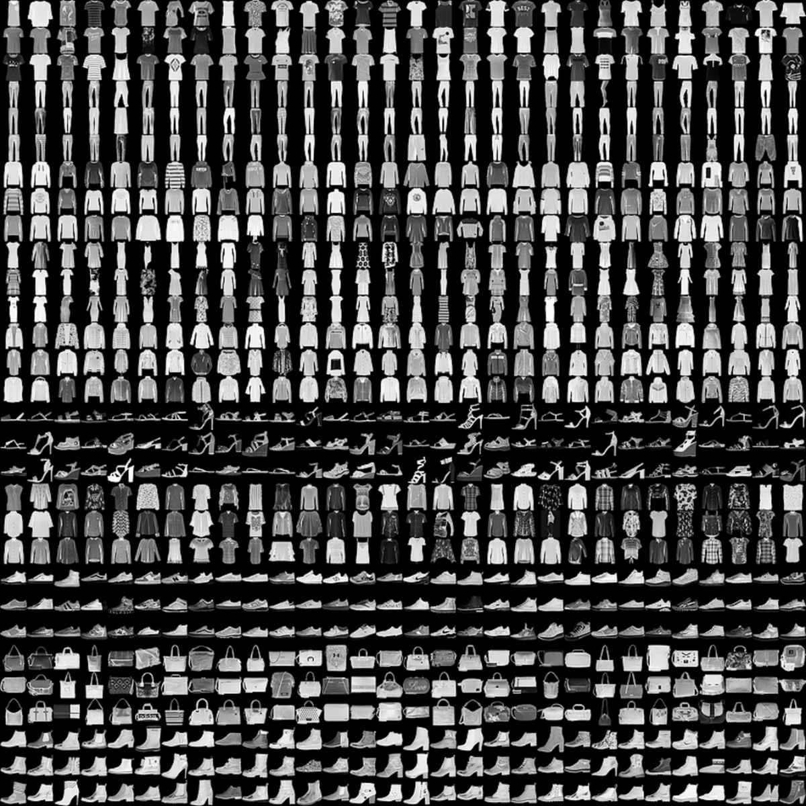

# Convolutional Neural Network - MNIST Fashion dataset
## Requirements
Quite a lot of libraries are required
Google them to install them depending on your OS
* keras / tensorflow
* numpy
* PIL
* cv2
* ...

## RUN
Go to your file directory, and run this command :
```bash
python3 main.py
```
By default it just apply the model, if you want to train it again
uncomment the function ```build_model()```

## Data

* Load for MNIST
* Data volume : 70 000 (Train 60 000 + Test 10 000)
* Input shape is 28x28x1 (Gray Scale Image)


## Architecture


## Hyperparameters
* loss = categorical_crossentropy
* optimizer = Adam
* batch_size=200
* epochs = 2

## Results
```bash
This image is a image/Tee-shirt
[0. 0. 1. 0. 0. 0. 0. 0. 0. 0.]
Predicted item is Pullover

This image is a image/Sneaker
[0. 0. 0. 0. 0. 0. 0. 1. 0. 0.]
Predicted item is Sneaker
```
